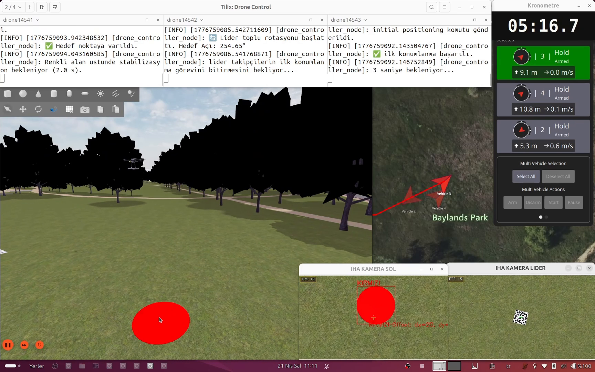
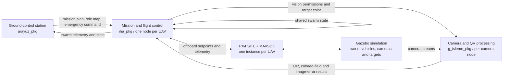

# Orion Swarm UAV Autonomy Stack

[Türkçe](README.tr.md)

ROS 2-based mission, coordination, and simulation workspace for a three-UAV
swarm developed by the six-member Orion Team for the 2026 TEKNOFEST Swarm UAV
project.

The system combines PX4 SITL, Gazebo, MAVSDK, ROS 2, a ground-control
interface, and camera processing. Its core autonomy flow covers dynamic
leader/follower role assignment, formation transitions, swarm telemetry,
QR-triggered mission changes, follower separation, and return-to-home
coordination.

## What this repository demonstrates

- A ROS 2 node and topic architecture for coordinating multiple UAVs.
- MAVSDK-based asynchronous flight and mission control over PX4 offboard mode.
- Dynamic slot assignment with one leader and an arbitrary number of
  left/right followers.
- V, line, and arrowhead formations with coordinated transitions.
- Shared telemetry, mission-state synchronization, collision-distance
  monitoring, and emergency landing commands.
- QR-driven mission transitions and camera-assisted colored-field workflows.
- A three-vehicle PX4 SITL and Gazebo simulation environment.

## System overview

The complete node, topic, state-machine, and message-contract description is
available in [Architecture](docs/architecture.md).

## Repository structure

| Path | Purpose |
| --- | --- |
| `src/iha_pkg` | MAVSDK connection, mission logic, role/state machines, formation control, telemetry, and navigation helpers. |
| `src/arayuz_pkg` | ROS 2 ground-control interface, mission input, telemetry panels, map, logs, and emergency command. |
| `src/g_isleme_pkg` | ROS/Gazebo/camera input, QR decoding, colored-field detection, and image-error publishing. |
| `scripts` | Local simulation and desktop orchestration helpers. |
| `docs` | Architecture, setup, validation boundaries, and contribution scope. |

## My contribution

**Hüseyin Sefa Kiriş — Orion Team founder and captain**

- Designed the overall software architecture, ROS 2 node layout, topic
  contracts, JSON message flow, and integration decisions.
- Developed `iha_pkg` end to end, including MAVSDK/PX4 connectivity,
  leader/follower state machines, offboard navigation, formation logic, swarm
  telemetry, mission transitions, and return-to-home flow.
- Built the three-UAV PX4 SITL/Gazebo simulation setup and scenario workflow.
- Coordinated the software work of the six-member team.

The ground-control UI implementation in `arayuz_pkg` and the image-processing
implementation in `g_isleme_pkg` were developed by other Orion team members.
They are included to preserve the integrated system, not presented as my
individual work. See [Contribution Scope](docs/contribution-scope.md).

## Environment

The project was developed with:

- Ubuntu 24.04
- ROS 2 Jazzy
- Python 3.12
- PX4 SITL and Gazebo Harmonic
- MAVSDK
- QGroundControl
- PyQt5, OpenCV, NumPy, GeographicLib, and Gazebo Python transport bindings

See [Build and Run](docs/build-and-run.md) for the verified build command,
node commands, simulation dependencies, and current portability limits.

## Verified baseline

The current source snapshot has been checked for:

- Python syntax across all source modules.
- Shell syntax of the Tilix simulation helper.
- Import availability of the three primary ROS 2 modules.
- Successful `colcon build --symlink-install` of `arayuz_pkg`, `iha_pkg`, and
  `g_isleme_pkg`.
- Fourteen passing unit tests for the pure navigation, swarm-message, and
  vision-message helpers.

These checks establish source and build integrity. They do not, by themselves,
claim real-aircraft validation or guarantee safe flight. The available
simulation recordings will be linked before the public portfolio release.

## Project status

This repository contains competition-era engineering code and remains under
portfolio preparation. Current limitations and external simulation
dependencies are documented in [Build and Run](docs/build-and-run.md).

Do not deploy this software to a real aircraft without an independent code
review, hardware-in-the-loop testing, operational risk assessment, and
appropriate flight-safety procedures.
