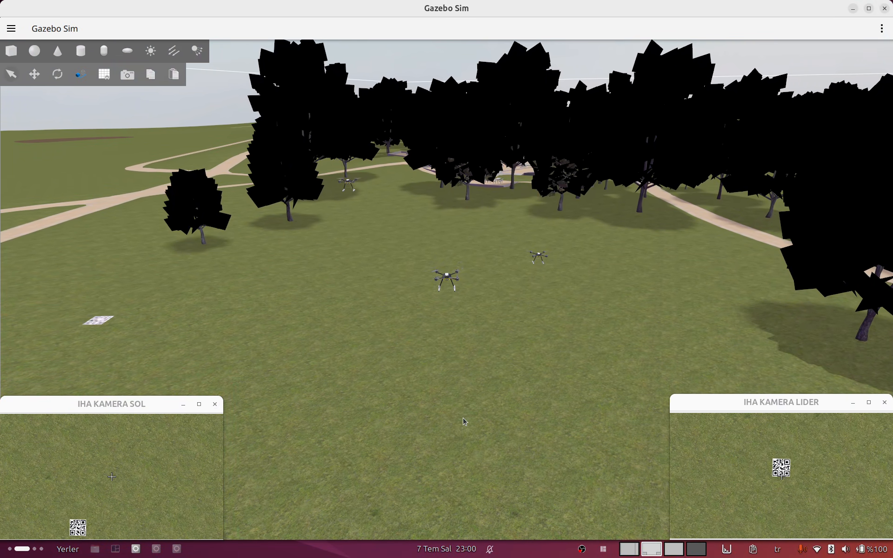
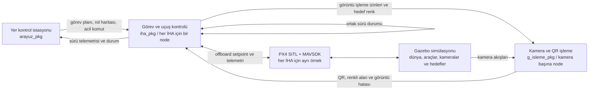

# Orion Sürü İHA Otonomi Yazılımı

[English](README.md)

Altı kişilik Orion Takımı tarafından TEKNOFEST Sürü İHA 2026 projesi için
geliştirilen, üç İHA'ya yönelik ROS 2 tabanlı görev, koordinasyon ve simülasyon
çalışma ortamıdır.

## Eşzamanlı sistem görünümü

Aşağıdaki ekran görüntüleri, üç İHA'lı simülasyonun aynı anını iki ayrı
ekranda göstermektedir.

### Gazebo simülasyonu ve kamera görüntüleri

### Dinamik yer kontrol istasyonu

Sistem; PX4 SITL, Gazebo, MAVSDK, ROS 2, yer kontrol istasyonu ve kamera
işleme bileşenlerini bir araya getirir. Temel otonomi akışı dinamik
lider/takipçi rol ataması, formasyon geçişleri, sürü telemetrisi, QR ile görev
değişimi, takipçinin sürüden ayrılması ve eve dönüş koordinasyonunu kapsar.

## Projenin gösterdiği başlıca çalışmalar

- Birden fazla İHA'yı koordine eden ROS 2 node ve topic mimarisi.
- PX4 offboard modunda MAVSDK tabanlı asenkron uçuş ve görev kontrolü.
- Bir lider ile istenen sayıda sol/sağ takipçiye yönelik dinamik slot ataması.
- V, çizgi ve okbaşı formasyonları ile koordineli geçişler.
- Ortak telemetri, görev durumu eşzamanlama, mesafe tabanlı çarpışma takibi ve
  acil iniş komutları.
- QR ile görev geçişi ve kamera destekli renkli alan görev akışları.
- Üç araçlı PX4 SITL ve Gazebo simülasyon ortamı.

## Sistem özeti

Node, topic, durum makinesi ve mesaj sözleşmelerinin ayrıntıları
[Mimari](docs/architecture.md) belgesinde yer alır.

## Repo yapısı

| Yol | Görevi |
| --- | --- |
| `src/iha_pkg` | MAVSDK bağlantısı, görev mantığı, rol/durum makineleri, formasyon kontrolü, telemetri ve navigasyon yardımcıları. |
| `src/arayuz_pkg` | ROS 2 yer kontrol istasyonu, görev girişi, telemetri panelleri, harita, loglar ve acil komut. |
| `src/g_isleme_pkg` | ROS/Gazebo/kamera girdisi, QR çözme, renkli alan algılama ve görüntü hatası yayını. |
| `scripts` | Yerel simülasyon ve masaüstü düzenleme yardımcıları. |
| `docs` | Mimari, kurulum, doğrulama sınırları ve katkı kapsamı. |

## Benim katkım

**Hüseyin Sefa Kiriş — Orion Takımı kurucusu ve takım kaptanı**

- Genel yazılım mimarisini, ROS 2 node yapısını, topic sözleşmelerini, JSON
  mesaj akışını ve entegrasyon kararlarını tasarladım.
- `iha_pkg` paketini baştan sona geliştirdim: MAVSDK/PX4 bağlantısı,
  lider/takipçi durum makineleri, offboard navigasyon, formasyon mantığı, sürü
  telemetrisi, görev geçişleri ve eve dönüş akışı.
- Üç İHA'lı PX4 SITL/Gazebo simülasyon kurulumunu ve senaryo akışını
  hazırladım.
- Altı kişilik ekibin yazılım çalışmalarını yönettim.

## Diğer yazılım katkıları

- **[Saadet Bayrakol](https://github.com/bayrakolsaadet) — Görüntü işleme:**
  `g_isleme_pkg` içindeki görüntü işleme uygulamasını geliştirdi.
- **[Eda Lazoğlu](https://github.com/EdanurLazoglu) — Yer kontrol arayüzü:**
  `arayuz_pkg` içindeki kullanıcı arayüzü uygulamasını geliştirdi.

Bu bileşenler bütünleşik sistemi korumak için repoda yer alır; kişisel
çalışmam gibi sunulmaz. Ayrıntı için
[Katkı Kapsamı](docs/contribution-scope.md) belgesine bakılabilir.

## Kullanılan ortam

- Ubuntu 24.04
- ROS 2 Jazzy
- Python 3.12
- PX4 SITL ve Gazebo Harmonic
- MAVSDK
- QGroundControl
- PyQt5, OpenCV, NumPy, GeographicLib ve Gazebo Python transport bağları

Doğrulanmış derleme komutu, node çalıştırmaları, simülasyon bağımlılıkları ve
mevcut taşınabilirlik sınırları [Derleme ve Çalıştırma](docs/build-and-run.md)
belgesindedir.

## Doğrulanmış başlangıç durumu

Mevcut kaynak görüntüsünde:

- Bütün Python kaynaklarının sözdizimi kontrol edildi.
- Tilix simülasyon yardımcısının shell sözdizimi kontrol edildi.
- Üç ana ROS 2 modülünün import edilebildiği doğrulandı.
- `arayuz_pkg`, `iha_pkg` ve `g_isleme_pkg` paketleri
  `colcon build --symlink-install` ile başarıyla derlendi.
- Saf navigasyon, sürü mesajı ve görüntü mesajı yardımcıları için 14 birim
  testi başarıyla geçti.

Bu kontroller kaynak ve derleme bütünlüğünü gösterir; tek başına gerçek İHA
doğrulaması veya güvenli uçuş garantisi değildir. Mevcut simülasyon videoları,
herkese açık portföy yayını öncesinde bağlantı olarak eklenecektir.

## Proje durumu

Bu repo yarışma döneminde geliştirilmiş mühendislik kodlarını içerir ve portföy
hazırlığı sürmektedir. Güncel sınırlamalar ile repo dışındaki simülasyon
bağımlılıkları [Derleme ve Çalıştırma](docs/build-and-run.md) belgesinde açıkça
belirtilmiştir.

Bağımsız kod incelemesi, donanım döngüde test, operasyonel risk değerlendirmesi
ve gerekli uçuş güvenliği süreçleri tamamlanmadan gerçek bir İHA üzerinde
kullanılmamalıdır.
