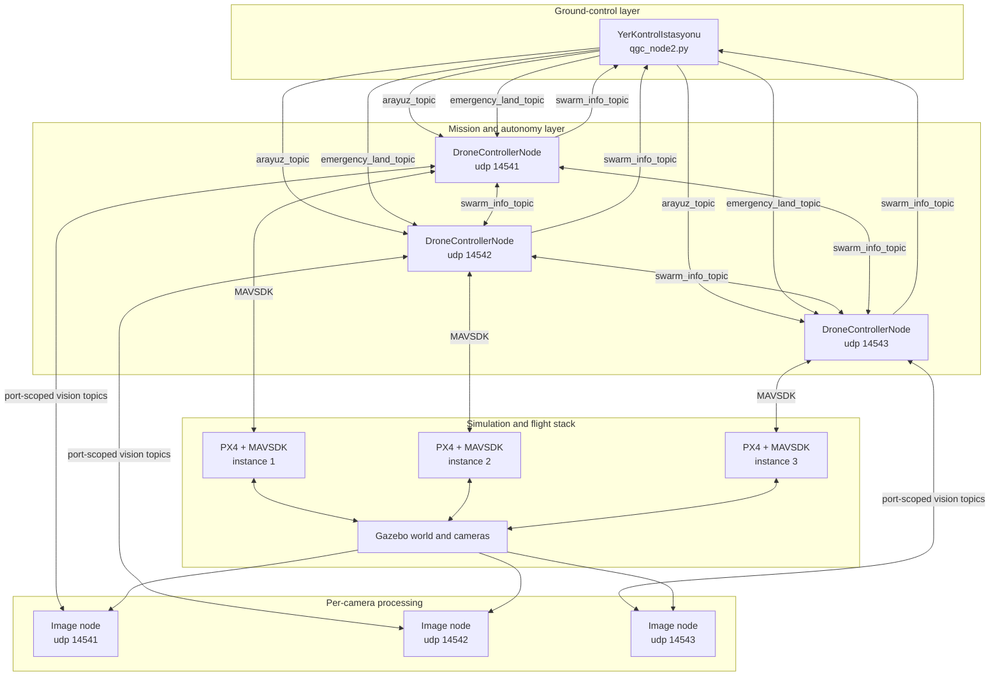
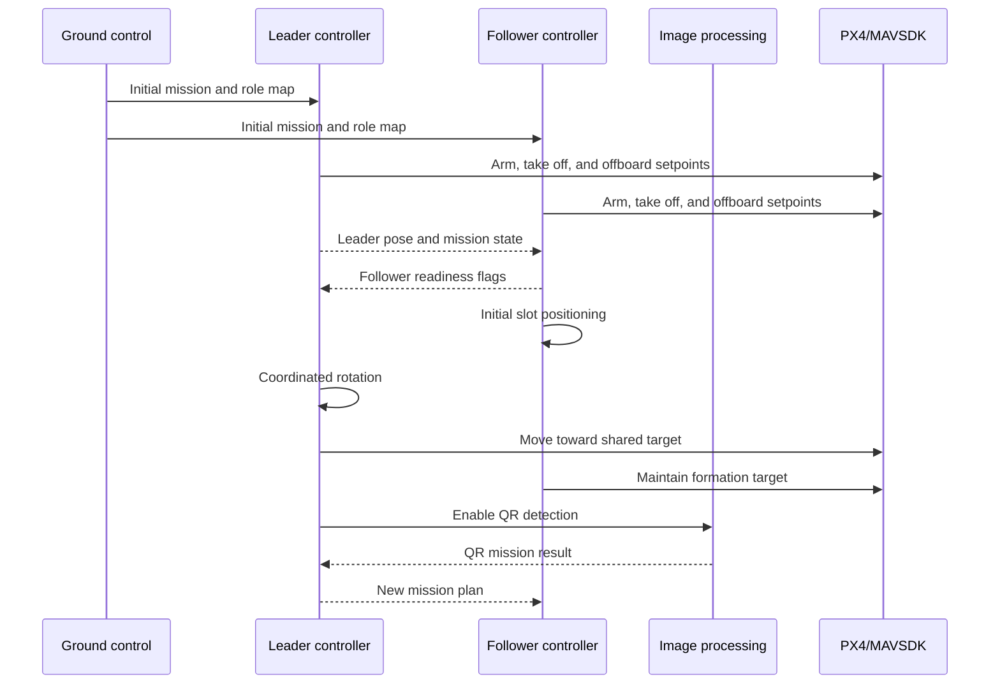

# Software Architecture

This document describes the current source tree. It distinguishes verified code
behavior from simulation evidence and avoids treating build artifacts or legacy
modules as active runtime components.

## Runtime components

| Component | Active entry point | Responsibility |
| --- | --- | --- |
| Ground-control station | `arayuz_pkg.qgc_node2:main` | Mission input, role assignment, telemetry panels, map display, ROS logs, and emergency landing. |
| UAV mission controller | `iha_pkg.uav_control:main` | MAVSDK connection, mission state machines, formation logic, offboard navigation, telemetry, and swarm coordination. |
| Image-processing node | `g_isleme_pkg.udp_img_prc:main` | ROS/Gazebo/camera input, QR decoding, colored-field detection, and image-error output. |
| PX4/Gazebo simulation | External PX4 checkout | Vehicle dynamics, autopilot instances, cameras, world, and simulated targets. |

One `DroneControllerNode` runs for each UAV. Image-processing nodes are scoped
to the corresponding UAV by UDP port.

## Node and data flow



## ROS 2 topic contract

| Topic | Direction | Payload purpose |
| --- | --- | --- |
| `arayuz_topic` | Ground control → UAV nodes | Initial mission plan and pre-mission role configuration. |
| `emergency_land_topic` | Ground control → UAV nodes | Emergency landing command. |
| `swarm_info_topic` | UAV nodes ↔ UAV nodes and ground control | Telemetry, role, state, mission flags, leader reference, and shared field coordinates. |
| `new_mission_topic` | Leader → all UAV nodes | QR-derived mission plan. |
| `udp_<port>_vision_control_topic` | UAV node → image node | QR/color/error permissions and target color. |
| `udp_<port>_qr_result_topic` | Image node → UAV node | Decoded QR payload and resolved mission plan. |
| `udp_<port>_colored_field_topic` | Image node → UAV node | Detected field color and image-space geometry. |
| `udp_<port>_x_y_error_topic` | Image node → UAV node | Target-center error for camera-assisted alignment. |

The mission and telemetry payloads are JSON objects carried in
`std_msgs/String`.

## Role and slot model

The mission plan maps MAVSDK UDP ports to slot indices:

```json
{
  "14541": -1,
  "14542": 0,
  "14543": 1
}
```

- Slot `0` is the leader.
- Negative slots are left followers.
- Positive slots are right followers.
- Exactly one leader is required.
- Slot values must be unique.

The code is not limited to the example's three slots; follower role keys are
generated from the configured slot map.

## Mission lifecycle



### Leader states

- `IDLE`
- `TAKE_OFF`
- `ROTATION`
- `MOVE`
- `RETURN_TO_HOME`

The leader also waits for follower takeoff, initial-positioning, and shared
target flags before advancing selected mission phases.

### Follower states

- `IDLE`
- `TAKE_OFF`
- `INITIAL_POSITIONING`
- `ROTATION`
- `MOVE`
- `GOTO_AREA`
- `LAND_TO_AREA`
- `RETURN_TO_HOME`

Follower targets are computed from the leader reference, formation angle, slot
distance, and configured formation.

## Navigation and control

The flight controller sends:

- `VelocityNedYaw` setpoints for global target, formation, and return-home
  navigation.
- `VelocityBodyYawspeed` setpoints for image-error-based local alignment.

The controller includes:

- NED velocity and acceleration limiting.
- Offboard pre-streaming before activation.
- Position and altitude arrival tolerances.
- Formation-distance scaling by slot.
- Three-dimensional inter-UAV distance monitoring.
- Controlled hold and offboard-stop routines.

The available formations are:

| Formation | Left angle | Right angle |
| --- | ---: | ---: |
| V | -30° | 30° |
| Line | -90° | 90° |
| Arrowhead | -150° | 150° |

## Image-processing integration

The active entry point resolves to `AdaptedImageProcessingNode`. It supports:

- ROS image topics.
- Gazebo Transport image topics.
- A physical camera fallback.
- WeChat QR with OpenCV's standard QR detector as fallback.
- Red/blue field detection using HSV, k-means, contour geometry, and color
  validation.
- Image-center error output for follower alignment.

An older `ImageProcessingNode` implementation remains in the same source file,
but the module aliases the public class name to `AdaptedImageProcessingNode`
before `main()` runs. Documentation and runtime claims therefore use the
adapted class.

## Active and legacy ground-control code

`qgc_node2.py` is the active ground-control implementation exposed by both
`interface` and `qgc_interface`.

The repository also contains older PyQt5/PySide6 interface experiments. They
are retained as project history but do not use the same topic and JSON contract
as the active interface.

## Validation boundary

Static inspection and a successful build establish that the source is
structurally coherent. They do not prove:

- Real-aircraft flight safety.
- Hardware compatibility.
- Successful operation with every PX4 or Gazebo release.
- Competition-rule compliance.

Simulation recordings are treated as simulation evidence only.
